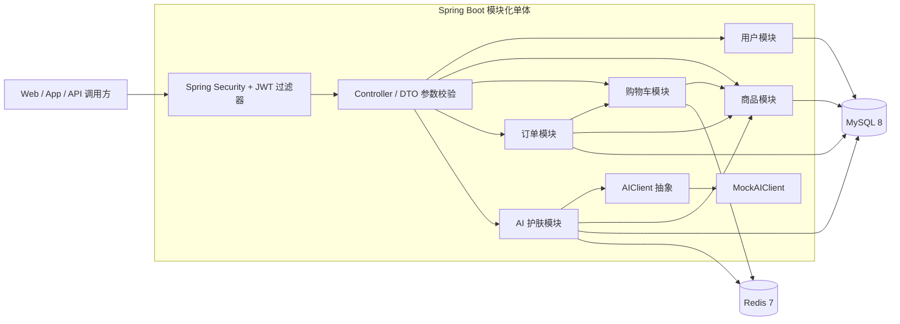
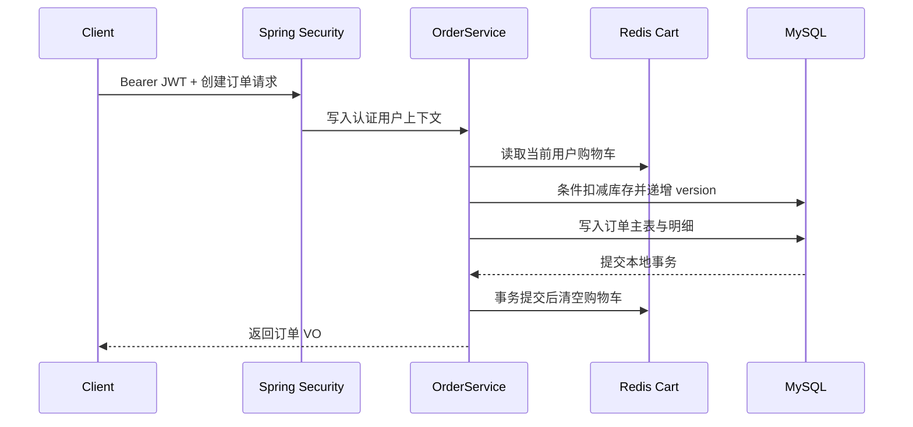

# SkinCareBackend

## 项目介绍

安稻护肤 AI 社区商城平台后端，是一个基于 Spring Boot 的模块化单体项目。项目围绕“用户认证—商品浏览—Redis 购物车—事务下单—AI 护肤分析”提供一组可运行、可测试的后端接口，并记录分层设计、数据一致性、缓存、安全认证和容器化部署等实现方式。

> 当前仓库聚焦后端能力：社区、支付、真实大模型和前端页面尚未实现，AI 分析由本地 `MockAIClient` 提供，不会调用外部模型。

## 项目定位

- 使用模块化单体架构组织用户、商品、购物车、订单和 AI 护肤等业务域。
- 围绕完整业务链路实现 JWT 认证、Redis 数据建模、事务边界和库存并发控制。
- 当前定位为学习与功能验证项目，不是生产级商城；暂不引入微服务、消息队列或分布式事务。
- 通过 Swagger、自动化测试和 Docker Compose 降低本地上手与部署验证门槛。

## 技术栈

| 分类 | 技术 |
| --- | --- |
| 基础环境 | Java 17、Maven |
| Web 框架 | Spring Boot 3.3.5、Spring MVC |
| 认证与安全 | Spring Security、JJWT 0.13.0、BCrypt |
| 数据访问 | MyBatis-Plus 3.5.7、MySQL 8 |
| 缓存 | Spring Data Redis、Redis 7 |
| 接口与校验 | Springdoc OpenAPI 2.6.0、Jakarta Validation |
| 测试 | JUnit 5、Mockito、AssertJ、Spring Test |
| 工程化 | Docker、Docker Compose、分环境 Spring Profile |

## 系统架构

项目按业务域组织代码，各业务域内部采用 Controller、Service、Mapper、Entity、DTO、VO 分层。认证、统一响应和异常处理放在 `common` 公共层。



典型下单链路：



## 功能模块

| 模块 | 已实现能力 |
| --- | --- |
| 用户与认证 | 用户注册、BCrypt 密码哈希、登录签发 JWT、Bearer Token 认证、用户状态复核 |
| 商品 | 启用分类下的上架商品列表、分类与关键词筛选、商品详情、库存扣减 |
| 购物车 | 基于 Redis Hash 的加入、查询、修改、删除；按最新商品信息计算金额 |
| 订单 | 从购物车下单、订单列表与详情、归属校验、取消已创建订单、商品快照 |
| AI 护肤 | Mock 肤质分析、建议生成、商品推荐、按用户保存与查询分析历史 |
| 公共能力 | 统一 `Result<T>`、业务错误码、全局异常处理、DTO 校验、Entity/VO 隔离 |
| 工程化 | dev/prod 配置分离、Docker 多阶段构建、MySQL/Redis 健康检查与 SQL 自动初始化 |

## 功能完成状态

| 能力 | 状态 | 说明 |
| --- | --- | --- |
| 用户注册与登录 | ✅ 已完成 | 密码 BCrypt 哈希保存，登录返回 JWT |
| JWT 接口认证 | ✅ 已完成 | 无状态认证，业务用户 ID 来自 `SecurityContext` |
| 商品查询 | ✅ 已完成 | 支持分类、关键词和商品详情查询 |
| Redis 购物车 | ✅ 已完成 | 使用 `cart:user:{userId}` Hash 隔离用户数据 |
| 订单与库存 | ✅ 已完成 | 本地事务、库存条件更新、乐观锁和订单快照 |
| AI 护肤分析 | ✅ Mock 完成 | Client 抽象、Redis 缓存、MySQL 历史记录均已完成 |
| Docker Compose 部署 | ✅ 已完成 | 应用、MySQL 8、Redis 一键启动 |
| 订单完整履约 | 🟡 部分完成 | 暂无支付、发货、退款和取消后库存恢复 |
| 真实大模型接入 | ⬜ 未实现 | 当前仅提供无外部依赖的 `MockAIClient` |
| 社区与前端 | ⬜ 未实现 | 不在当前后端阶段范围内 |

## 关键设计

### JWT 无状态认证

Spring Security 使用 `STATELESS` 会话策略。自定义过滤器从 `Authorization: Bearer <token>` 中解析 JWT，校验签名、签发方和有效期，再复核数据库中的用户状态并写入 `SecurityContext`。购物车、订单和 AI 历史均从认证上下文读取用户 ID，不信任客户端提交的身份参数。

### Redis 购物车

购物车使用 Redis Hash：Key 为 `cart:user:{userId}`，field 为商品 ID，value 为数量。Redis 不缓存价格和库存，查询及下单时重新读取商品模块中的最新数据，避免使用过期价格作为成交依据。

### AI 结果缓存

规范化肤质、年龄和问题后计算 SHA-256，形成 `ai:skin:{hash}` 缓存 Key；分析结果以 JSON 缓存 30 分钟。缓存故障时会降级调用当前的 `MockAIClient`，不阻断分析和 MySQL 历史记录持久化。该缓存只是减少相同输入的重复计算，不代表已经接入真实大模型。

### AI Client 抽象设计

业务层只依赖 `AIClient` 接口，当前注入本地 `MockAIClient`。未来接入真实供应商时可新增实现，而无需把 SDK 协议侵入 Controller、分析流程或商品推荐逻辑。

### MySQL 事务

下单流程中的库存扣减、订单主表和全部明细写入位于同一个 `@Transactional` 本地事务中。库存或订单写入任一步失败都会整体回滚；Redis 购物车通过事务同步回调在数据库提交后清理，避免回滚时提前丢失购物车。

### 乐观锁库存并发控制

库存更新同时校验商品状态、`stock >= quantity` 和当前 `version`，成功时原子执行库存递减与版本递增。并发请求使用同一版本更新时只有一个请求能够成功，其余请求收到库存冲突；库存下限条件避免库存扣成负数。这是单体应用中的基础并发控制，不等同于秒杀或大规模高并发库存方案。

### Docker 部署

Dockerfile 使用 Maven 构建阶段和 JRE 运行阶段分离，并以非 root 用户运行应用。Docker Compose 编排 Spring Boot、MySQL 8 和 Redis，通过健康检查控制启动顺序，并在 MySQL 首次启动时自动执行全部建表脚本。

## 项目结构

```text
SkinCareBackend/
├─ src/main/java/com/andao/skincare/
│  ├─ common/                # 安全、异常、统一响应、公共配置
│  └─ module/                # user、product、cart、order、ai 业务域
├─ src/main/resources/       # dev/prod 配置
├─ src/test/java/            # JWT、AI、订单库存等单元测试
├─ docs/sql/                 # MySQL 建表脚本
├─ Dockerfile
├─ docker-compose.yml
└─ docs/                     # API、数据库、启动与部署文档
```

## 本地启动

环境要求：JDK 17、Maven 3.9+、MySQL 8、Redis。

1. 创建数据库 `andao_skincare`，依次执行：

   ```text
   docs/sql/user.sql
   docs/sql/product.sql
   docs/sql/order.sql
   docs/sql/ai.sql
   ```

2. 配置数据库密码，并提供 Base64 格式、解码后不少于 32 字节的 JWT 密钥：

   ```powershell
   $env:MYSQL_USERNAME = "root"
   $env:MYSQL_PASSWORD = "你的MySQL密码"
   $jwtBytes = New-Object byte[] 32
   [System.Security.Cryptography.RandomNumberGenerator]::Fill($jwtBytes)
   $env:JWT_SECRET = [Convert]::ToBase64String($jwtBytes)
   ```

3. 确保 Redis 运行在 `localhost:6379`，然后启动：

   ```powershell
   mvn spring-boot:run
   ```

默认使用 `dev` Profile。完整环境变量和故障排查见 [项目启动指南](docs/STARTUP.md)。

## Docker 启动

环境要求：Docker Engine 24+、Docker Compose v2。

```bash
docker compose up -d --build
docker compose ps
```

首次启动会创建 `andao_skincare` 数据库并自动执行四个 SQL 脚本。生产或共享环境应先通过 `.env` 覆盖 `MYSQL_PASSWORD`、`MYSQL_ROOT_PASSWORD` 和 Base64 格式的 `JWT_SECRET`。停止服务：

```bash
docker compose down
```

完整说明见 [Docker 部署文档](docs/DOCKER.md)。

## Swagger 地址

应用使用默认端口 `8080` 时：

- Swagger UI：<http://localhost:8080/swagger-ui.html>
- OpenAPI JSON：<http://localhost:8080/v3/api-docs>

接口请求、响应和错误场景见 [API 文档](docs/API.md)。

## 测试说明

执行全部测试：

```bash
mvn test
```

当前测试基线为 22 个测试，覆盖：

- JWT 签发、解析、无效凭证处理及认证过滤器。
- AI Client、AI 缓存命中/未命中、缓存降级与历史记录。
- 下单顺序、库存失败阻断订单、事务提交后购物车清理。
- 库存下限、version 条件更新和并发冲突。
- 全局异常响应和商品查询行为。

## 设计要点

| 主题 | 说明 |
| --- | --- |
| JWT 无状态认证 | Filter 链位置、Token 最小声明、用户状态复核、401 统一处理 |
| Redis 购物车 | Hash 数据结构选择、用户隔离、只存 ID 与数量的取舍 |
| AI 结果缓存 | 规范化输入、SHA-256 Key、TTL、缓存故障降级与历史数据边界 |
| AI Client 抽象 | 依赖倒置、Mock 可测试性、真实供应商实现的替换路径 |
| MySQL 事务 | 库存与订单原子性、`MANDATORY` 传播、提交后清理 Redis |
| 乐观锁库存并发控制 | 库存下限 + version 条件、原子更新、并发失败语义及适用边界 |
| Docker 部署 | 多阶段镜像、非 root 运行、健康检查、初始化脚本、环境隔离 |

## 相关文档

- [项目说明](docs/PROJECT.md)
- [项目启动指南](docs/STARTUP.md)
- [Docker 部署](docs/DOCKER.md)
- [API 文档](docs/API.md)
- [数据库设计](docs/DATABASE.md)
- [AI 开发上下文](docs/AI_CONTEXT.md)
